# AIoTDB分布式数据库存储引擎

AIoT（人工智能物联网）=AI（人工智能）+IoT（物联网）。融合AI技术和IoT技术，通过物联网产生、收集来自不同维度的、海量的数据存储于云端、边缘端，再通过大数据分析，以及更高形式的人工智能，实现万物数据化、万物智联化。

<b style="color:red">AIoTDB</b>应运而生，是一款<b style="color:red">聚焦物联网、高性能轻量级的时序数据库</b>，为用户提供数据收集、存储和分析等服务

PS：跨平台，支持（win、linux、mac）运行，无需安装依赖环境


## 核心设计原理

​    我们的理念：行业需要什么，我们就做什么，用户需要什么，我们提供什么。

### 大数据痛点

- `Apache Hadoop`基于`hdfs`存储，基于`MapReduce`任务查询，并发数量较少，任务型驱动<b style="color:red">不够实时</b>
- `hdfs`文件存储基本存储单位为64M(`Hadoop2`中是128M)，如果是大量的小文件，会<b style="color:red">消耗大量内存</b>
- 基于 `Apache Hive`的查询引擎，涉及到`HSQL`语句转变成`MapReduce`任务来执行，<b style="color:red">严重影响并发与查询实时性</b>
- 基于`Apache Impala`的查询引擎，不依赖`MapReduce`任务，采用内存计算，<b style="color:red">对内存要求极高</b>
- 综上所述：<b style="color:red">大数据适合大文件持续任务化分析，不适合物联网碎片化数据存储</b>


### AIoTDB分布式集群设计原理

- 参照`Apache Hadoop`、`Apache Hive`、`Elastic Search`、`Apache IotDB`、`TD Engine`、`MySql`、`ETCD`、`Apache ApiSix`、`Linux`等设计原理，糅合功能优缺点，<b style="color:red">创造</b>`AIoTDB`
- 实时查询，采用拉取式查询，<b style="color:red">毫秒级查询</b>
- 分布式文件存储，集群去中心化自动文件负载
- `DataNode`文件块最小8kb占用空间，理论存储文件数<b style="color:red">4294967295</b>个
- `ManageNode`提供分布式集群节点`DataNode`的`Meta`信息，去除类`MapReduce`任务引擎，可选集成`Redis`加速`ASQL`选中执行器
- `ResourceNode`提供<b style="color:red">分布式数据代理节点</b>，结合`ManageNode`统一提供对外服务
- `独立网关`绑定域名，可对不同厂商提供<b style="color:red">云数据服务</b>
- 包含 <b style="color:red">事件驱动、离线计算、机器学习</b> 等可选服务


> 时间线划分原理

- 由`租户`、`项目`、`区域`、`设备`、`测点` 维度进行建立时间线，自动进行数据存储，无需用户干预。如：`t01.p01.a01.d01.p01`

  ```mermaid
  graph LR;
      租户-->项目;
      项目-->区域;
      区域-->设备;
      设备-->测点;
  ```

- 融合节点使用`root`标识，如（无区域）节点：`t01.p01.root.d01.p01`


## 服务器配置参考

<b style="color:red">CPU最大支持64核，否则磁盘IO在CPU满载情况下无法满足高并发</b>

| CPU    | 内存   | 硬盘      | 存储量     |
| ------ | ------ | --------- | ---------- |
| 4      | 16     | 500GB SSD | 200亿      |
| 8      | 16     | 500GB SSD | 200亿      |
| 16     | 32     | 1TB SSD   | 400亿      |
| 32     | 32     | 2TB SSD   | 800亿      |
| 64     | 32     | 4TB SSD   | 1600亿     |
| 64     | 64     | 8TB SSD   | 3000亿     |
| 分布式 | 分布式 | 分布式    | 理论上无限 |


## 性能

**服务器**（http）

- CPU 8核

- 内存32G
- 普通硬盘2T

**客户端**（http）

- CPU 8核

- 内存32G

### 写入性能

存储空间仅占Elastic Search存储空间的 <b style="color:red">16.4%</b>

| 总数据量 | 线程数量 | 循环次数 | 批量  | 耗时 | AIOTDB存储空间 | 对比ES存储空间 |
| -------- | -------- | -------- | ----- | ---- | -------------- | -------------- |
| 1600     | 16       | 100      | 1     | 29s  | 128 KB         | 0.3 MB         |
| 16万     | 16       | 100      | 100   | 29s  | 5.12 MB        | 18.8 MB        |
| 160万    | 16       | 100      | 1000  | 30s  | 49.9 MB        | 302 MB         |
| 800万    | 16       | 100      | 5000  | 87s  | 249 MB         | 1509 MB        |
| 1600万   | 16       | 100      | 10000 | 113s | 498 MB         | 3019 MB        |

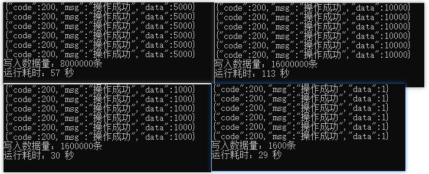


### 查询性能

​    极致性能，取决于服务器配置。<b style="color:red">毫秒级别查询！！！</b>

## 可视化数据查询展示

​    <b style="color:red">物联网数据库存储引擎自带！！！无需额外安装插件，即查即渲染，直接可视化</b>

### SVG展示

- > 支持`svg`图表展示，浏览器直接可以访问

  ```http
  GET     /v1/draw/svg?w={h}&h={h}&sql={sql}
  
  POST    /v1/draw/svg
  Content-Type: application/json'
  {
  	"sql":"{sql}",
  	"w":{w},
  	"h":{h}
  }
  ```

- 参数说明：`*`标记参数为必填参数

  - `*sql`：查询时序数据`ASQL`引擎语句
  - `w`：页面渲染内容`width`，数字类型，单位`px`，默认值：1440
  - `h`：页面渲染内容`height`，数字类型，单位`px`，默认值：576

- 示例数据：

  ```http
  curl --location --request GET 'http://127.0.0.1:8567/v1/draw/svg?w=1500&h=700&sql=select * from `t01.p01.a01.d01.p01` where id>1664267730968 ORDER BY ts desc LIMIT 100'
  ```

- 效果展示：

  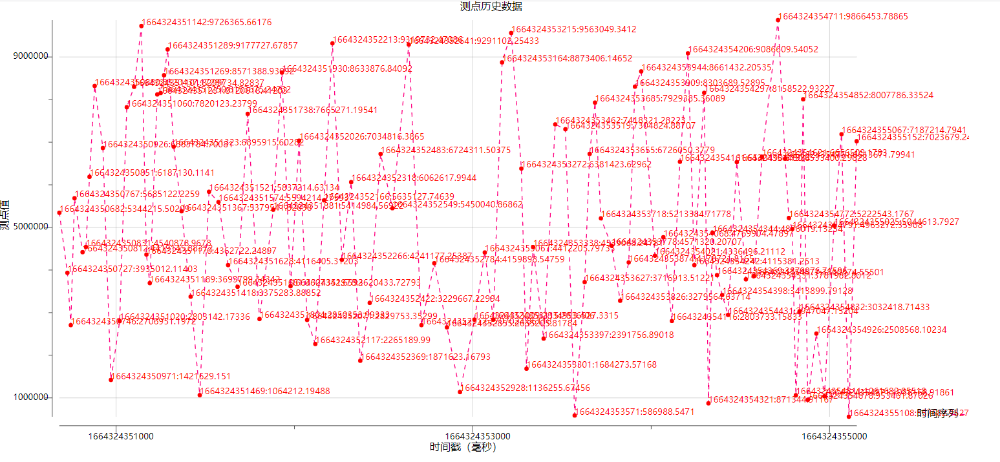

### Echarts展示

- > 支持`echarts`图表展示，浏览器直接可以访问

  ```http
  GET     /v1/draw/echarts?w={h}&h={h}&sql={sql}
  
  POST    /v1/draw/echarts
  Content-Type: application/json'
  {
  	"sql":"{sql}",
  	"w":{w},
  	"h":{h}
  }
  ```
  
- 参数说明：`*`标记参数为必填参数

  - `*sql`：查询时序数据`ASQL`引擎语句
  - `w`：页面渲染内容`width`，数字类型，单位`px`，默认值：1440
  - `h`：页面渲染内容`height`，数字类型，单位`px`，默认值：576

- 示例数据：

  ```http
  curl --location --request GET 'http://127.0.0.1:8567/v1/draw/echarts?w=1500&h=700&sql=select * from `t01.p01.a01.d01.p01` where id>1664267730968 ORDER BY ts desc LIMIT 100'
  ```

- 效果展示：

  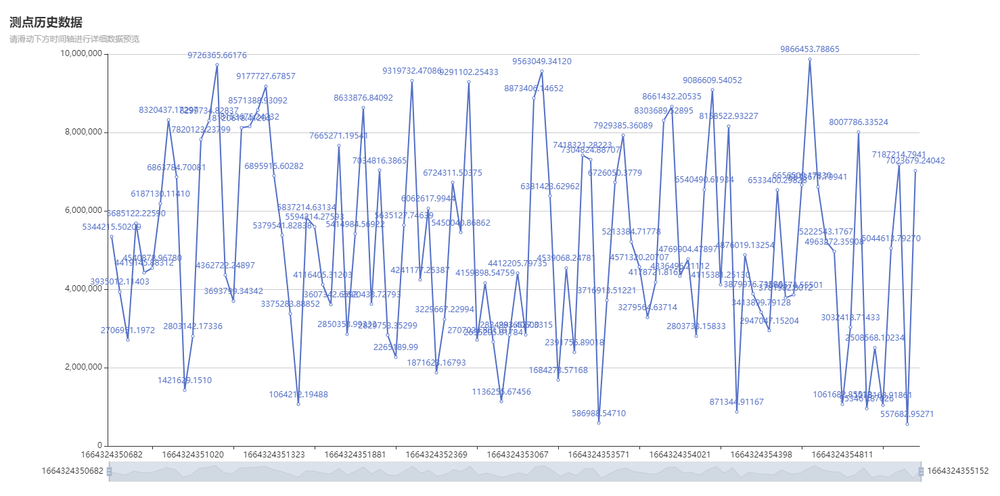


## 数据接入方式

目前支持两种接入方式

- MQTT
- Http


### MQTT接入

> Mqtt broker 代理服务端口号默认：<b style="color:red">1883</b>

#### <span id="mqtt_point">点存储</span>

- **topic：**`point`

- **payload：**

  ```json
  {
    "name": "{name为测点信息}",
    "values":{
      "{测点毫秒时间戳01}":"{测点值01}",
      "{测点毫秒时间戳02}":"{测点值02}"
    }
  }
  ```

- 示例数据

  ```json
  {
    "name": "t01.p01.a01.d01.p01",
    "values":{
      "1663315220055":"0.1234",
      "1663315220056":"0.4567"
    }
  }
  ```

  


#### <span id="mqtt_device">设备存储</span>

- **topic：**`device`

- **payload：**

  ```json
  {
  	"name": "{name为测点信息}",
  	"values": {
  		"{测点01}": {
  			"{测点毫秒时间戳01}": "{测点值01}",
  			"{测点毫秒时间戳02}": "{测点值02}"
  		},
  		"{测点02}": {
  			"{测点毫秒时间戳02}": "{测点值01}",
  			"{测点毫秒时间戳03}": "{测点值02}"
  		}
  	}
  }
  ```

- 示例数据

  ```json
  {
  	"name": "t01.p01.a01.d01",
  	"values": {
  		"p01": {
  			"1663315220055": "0.1234",
  			"1663315220056": "0.2345"
  		},
  		"p02": {
  			"1663315220057": "0.5678",
  			"1663315220058": "0.6789"
  		}
  	}
  }
  ```


### Http接入

> Http接入服务端口号默认：<b style="color:red">8567</b>

#### AIoT-SQL引擎说明

> 注意：
>
> 所有的数据库名称、数据字段名称,统一使用 ` 分割符号进行包裹，否则无法识别
>
> sql引擎不支持;符号

​    <b style="color:red">MySQL语法</b>基本上都会吧，兼容大部分MySQL查询语句

#### 存储API

- > 支持批量存储

  ```http
  # 最大支持100条数据批量写入
  GET     /v1/execute?sql={sql}
  
  # 最大支持1万条数据写入，建议最多5000
  POST    /v1/execute
  Content-Type: application/json'
  {
  	"sql":"{sql}"
  }
  ```

  

- 示例数据：

  ```http
  curl --location --request POST 'http://127.0.0.1:8567/v1/execute' \
  --header 'Content-Type: application/json' \
  --data-raw '{
      "sql": "INSERT INTO `t01.p01.a01.d01.p01` VALUES (16627392970000, '\''2509.5506'\''),(16627392971000, '\''2509.5506'\''),(16627392972000, '\''2509.5506'\'')"
  }'
  ```

  

#### 查询API

> 支持条件筛选与排序

#### 查询时序数据

-  请求说明

  ```http
  GET     /v1/query?sql={sql}
  
  POST    /v1/query
  Content-Type: application/json'
  {
  	"sql":"{sql}"
  }
  ```

- 示例数据：

  ```http
  curl --location --request GET 'http://127.0.0.1:8567/v1/query?sql=select * from `t01.p01.a01.d01.p01` where `ts`>  166273926100 order by `ts` desc  limit 10'
  ```

- 查询结果：

  ```json
  {
      "code": 200,
      "msg": "操作成功",
      "data": [
          {
              "ts": 1664515379000,
              "value": "452"
          },
          {
              "ts": 1664515380000,
              "value": "467"
          },
          {
              "ts": 1664515381000,
              "value": "654"
          }
      ]
  }
  ```

  

#### 统计时序数量

-  请求说明

  ```http
  GET     /v1/query?sql={sql}
  
  POST    /v1/query
  Content-Type: application/json'
  {
  	"sql":"{sql}"
  }
  ```

- 示例数据：

  ```http
  curl --location --request GET 'http://127.0.0.1:8567/v1/query?sql=select count(*) from `t01.p01.a01.d01.p01` where `ts`>  166273926100'
  ```

- 查询结果：

  ```json
  {
      "code": 200,
      "msg": "操作成功",
      "data": 3
  }
  ```


#### 时间序列查询

  <b style="color:red">`*`</b>表示一级时间序列（可省略），<b style="color:red">`**`</b>表示无限级时间序列

-  请求说明

  ```http
  GET     /v1/query?sql={sql}
  
  POST    /v1/query
  Content-Type: application/json'
  {
  	"sql":"{sql}"
  }
  ```

- 示例数据：

  ```http
  # 查询一级时间序列
  curl --location --request GET 'http://127.0.0.1:8567/v1/query?sql=show `t01.p01.a01`'
  curl --location --request GET 'http://127.0.0.1:8567/v1/query?sql=show `t01.p01.a01.*`'
  # 查询所有时间序列
  curl --location --request GET 'http://127.0.0.1:8567/v1/query?sql=show `t01.p01.a01.**`'
  ```

- 查询结果：

  ```json
  # 查询一级时间序列
  # curl --location --request GET 'http://127.0.0.1:8567/v1/query?sql=show `t01.p01.a01.*`'
  # curl --location --request GET 'http://127.0.0.1:8567/v1/query?sql=show `t01.p01.a01.*`'
  {
      "code": 200,
      "msg": "操作成功",
      "data": [
          "t01.p01.a01.d01.*",
          "t01.p01.a01.d02.*"
      ]
  }
  
  # 查询所有时间序列
  # curl --location --request GET 'http://127.0.0.1:8567/v1/query?sql=show `t01.p01.a01.**`'
  {
      "code": 200,
      "msg": "操作成功",
      "data": [
          "t01.p01.a01.*",
          "t01.p01.a01.d01.*",
          "t01.p01.a01.d01.23",
          "t01.p01.a01.d01.24",
          "t01.p01.a01.d01.*",
          "t01.p01.a01.d02.22"
      ]
  }
  ```
  
  


## 通用API

### 健康检查

- > 服务状态健康检查

  ```http
  GET    /node/health
  ```

  

- 示例数据

  ```http
  http://127.0.0.1:8567/node/health
  ```


### 服务器节点状态

- > 服务状态健康检查

  ```http
  GET /node/host
  ```

  

- 示例数据

  ```http
  http://127.0.0.1:8567/node/host
  ```


## 事件驱动

## 机器学习

## 离线计算


## EMQX集成

### <span id="point_broker">测点数据转发</span>

#### 配置规则

使用浏览器打开`EMQX`的 `Dashboard`，在规则引擎页面创建一条规则：

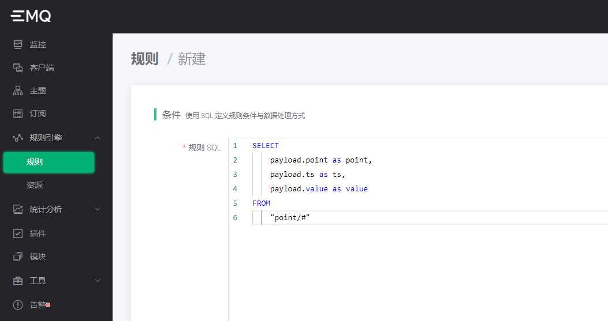

SQL 语句为：

```sql
SELECT
    payload.point as point,
    payload.ts as ts,
    payload.value as value
FROM
    "point/#"
```

测试数据有效性

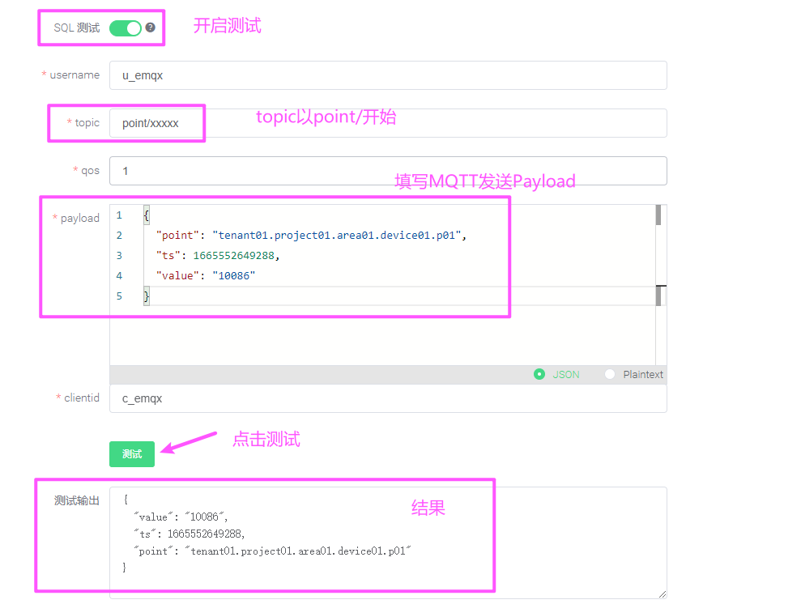

Payload 语句为：

```json
{
	"point": "tenant01.project01.area01.device01.p01",
	"ts": 1665552649288,
	"value": "10086"
}
```

然后我们在页面的底部，给规则加一个「桥接数据到 MQTT Broker」动作：

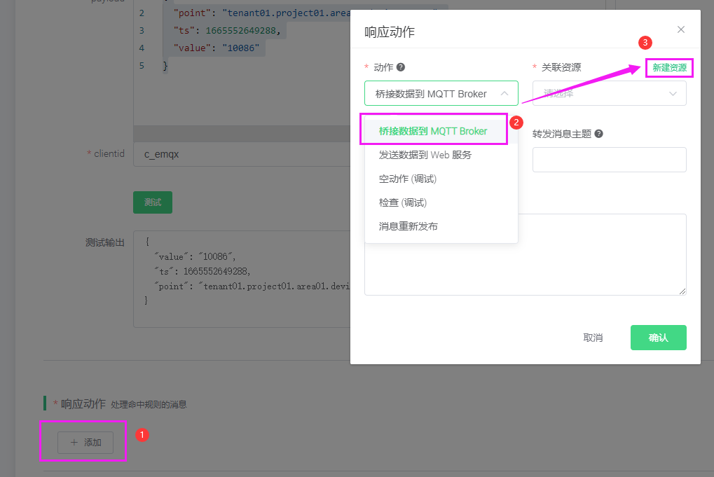

这个动作需要关联一个资源，我们点击右上角的「新建资源」来创建一个`MQTT Bridge`资源：

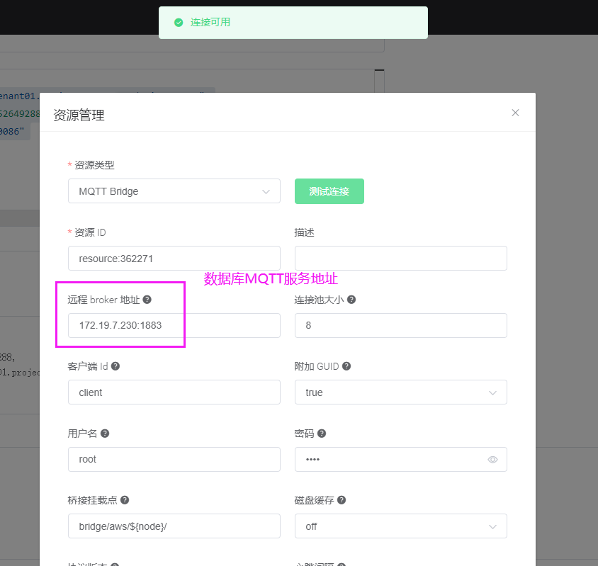

远程 Broker 地址要填写 AIoTDB 的 MQTT 服务地址，即 "IP:1883"。客户端 Id、用户名、密码都填写 root，因为 root 是 AIoTDB 默认的用户名和密码。

其他选项保持默认值不变，点击「测试连接」按钮确保配置无误，然后再点击右下角的「新建」按钮创建资源。

现在返回到动作创建页面，关联资源的下拉框里自动填充了我们刚才创建的资源。

现在我们继续填写更多的动作参数：

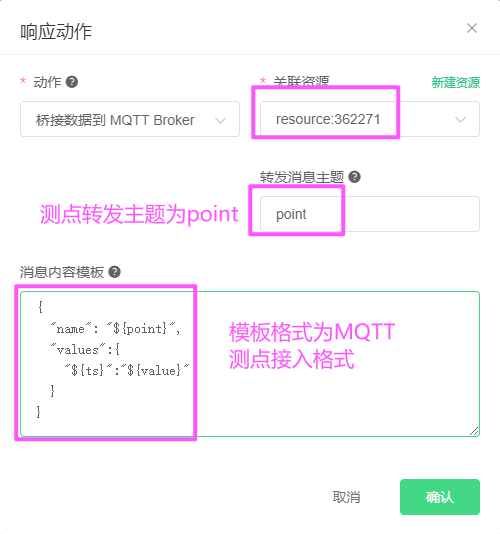

AIoTDB 测点主题：`point`。

AIoTDB 要求消息内容是一个 JSON 格式，消息内容模板可以按照上图中样式填写。详情请参见[MQTT点存储](#mqtt_point)

```json
{
  "name": "${point}",
  "values":{
    "${ts}":"${value}"
  }
}
```

注意其中的 "${point}", "${ts}" 以及 "${value}" 都是从规则的 SQL 语句的输出中提取的变量，所以必须保证这些变量跟 SQL 语句的 SELECT 字句对应上。

现在可以点击「确认」保存动作配置


#### 使用 MQTT Client 发送消息

使用 MQTTX 客户端工具（https://mqttx.app），来发送一条消息给 `EMQX`：

MQTT 客户端的连接参数里面，我们注意端口号，使用`EMQX`服务的1883端口（端口可修改），其他的保持默认值不变。

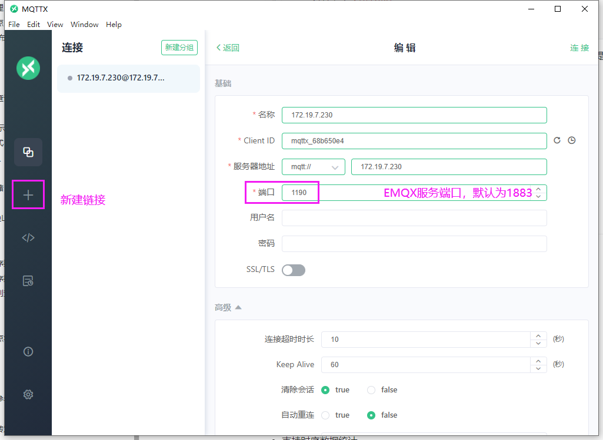

模拟设备发送一条MQTT数据到`EMQX`代理服务

连接成功之后，我们发送 1 条主题为：`point/xxxxxxxx` 的消息，消息内容格式为：

```json
{
	"point": "tenant01.project01.area01.device01.p01",
	"ts": 1665552649288,
	"value": "10086"
}
```

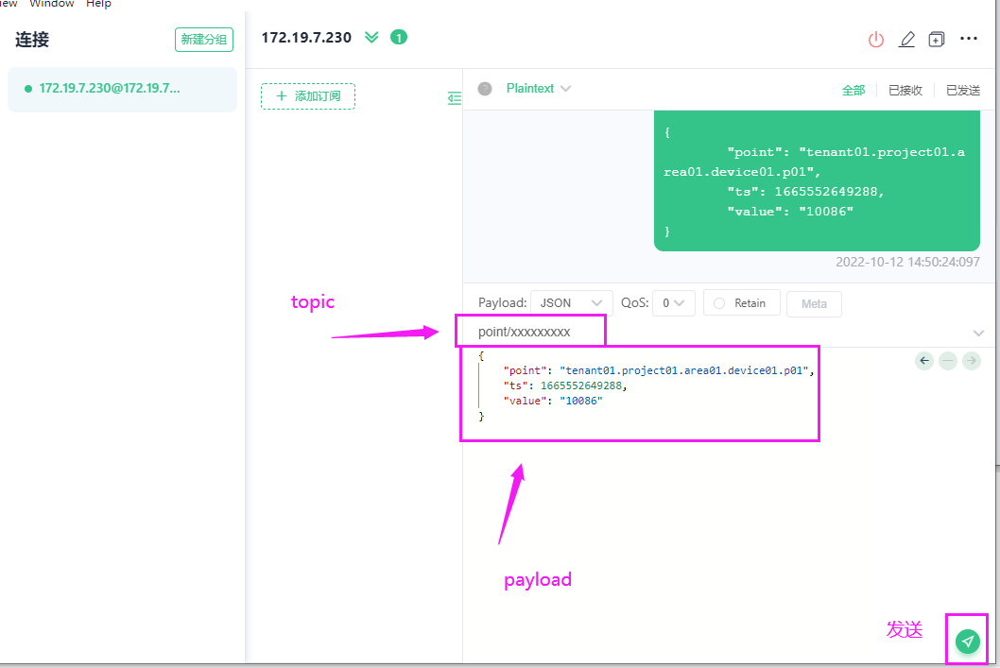

然后回到 `EMQX Dashboard` 的规则引擎页面，观察规则的命中次数，确认规则被触发了 1 次：

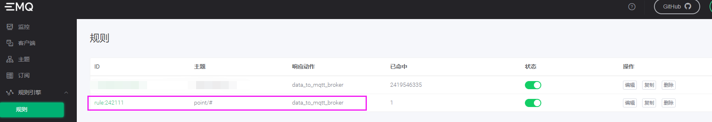

最后我们查询`AIoTDB`数据，浏览器访问如下地址：

```http
http://172.19.7.230:8567/v1/query?sql=select * from `tenant01.project01.area01.device01.p01`

{
	"code": 200,
	"msg": "操作成功",
	"data": [{
		"ts": 1665552649288,
		"value": "10086"
	}]
}
```


### 设备数据转发

参照[测点数据转发](#point_broker),消息内容模板可以请参见[MQTT设备存储](#mqtt_device)


## Release版本记录


### 0.1.X计划

- ~~集群化~~
- ~~机器学习~~
- ~~离线计算~~
- ~~事件驱动~~


### 0.1.6 [released]

- 支持 Insert Or Replace 操作
- 极致性能优化，磁盘IO占用释放60%，性能提升3倍


### 0.1.5 [released]

- 支持时序数据统计

- 支持时间线节点查询


### 0.1.4 [released]

- 可视化查询
- mqtt设备接入


### 0.1.3 [released]

- 连接池深度优化
- mqtt测点接入
- 批量写入压测
- 通用返回封装


### 0.1.2 [released]

- 启用网络请求压缩，感觉不压缩速度更快
- 支持批量写入
- 支持前后端一体化打包
- 提供`/node`服务器节点状态API
- 添加配置文件，支持动态调整日志等级
- 添加跨域支持


### 0.1.1 [released]

- 添加首页支持
- 提供`/health`健康检查API
- 优化`/query`、`/execute` 接口添加版本号`v1`，变更为`/v1/query`、`/v1/execute`
- 打包使用release生产版本，运行时使用`set GIN_MODE=release`
- 完成同时支持`get`、`post`参数传递


### 0.1.0 [released]

- 开放`/query`、`/execute` 接口
- 数据支持存储与展示
- 打包支持跨平台部署