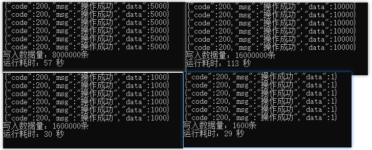

## 性能

**服务器**（http）

- CPU 8核

- 内存32G
- 普通硬盘2T

**客户端**（http）

- CPU 8核

- 内存32G

### 写入性能

存储空间仅占Elastic Search存储空间的 <b style="color:red">16.4%</b>

| 总数据量 | 线程数量 | 循环次数 | 批量  | 耗时 | AIOTDB存储空间 | 对比ES存储空间 |
| -------- | -------- | -------- | ----- | ---- | -------------- | -------------- |
| 1600     | 16       | 100      | 1     | 29s  | 128 KB         | 0.3 MB         |
| 16万     | 16       | 100      | 100   | 29s  | 5.12 MB        | 18.8 MB        |
| 160万    | 16       | 100      | 1000  | 30s  | 49.9 MB        | 302 MB         |
| 800万    | 16       | 100      | 5000  | 87s  | 249 MB         | 1509 MB        |
| 1600万   | 16       | 100      | 10000 | 113s | 498 MB         | 3019 MB        |

### 查询性能

极致性能，取决于服务器配置。<b style="color:red">毫秒级别查询！！！</b>