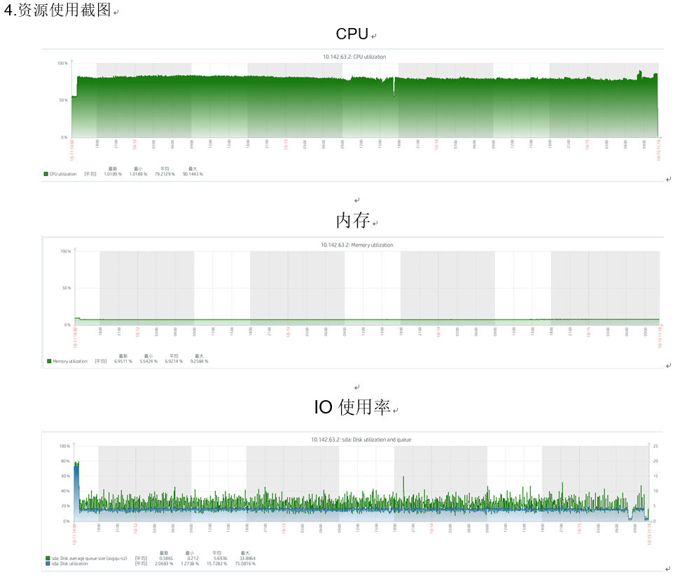

## 性能

| 环境   | CPU  | 内存 | 硬盘       |
| ------ | ---- | ---- | ---------- |
| 服务器 | 8    | 32G  | 普通盘500G |
| 客户端 | 8    | 32G  | 普通盘2T   |

### 写入性能

- 累计写入数据<b style="color:red">131.6亿</b>
- 存储空间仅占Elastic Search存储空间的 <b style="color:red">16.4%</b>

### 查询性能

极致性能，取决于服务器配置。<b style="color:red">毫秒级别查询！！！</b>

### 测试结果

