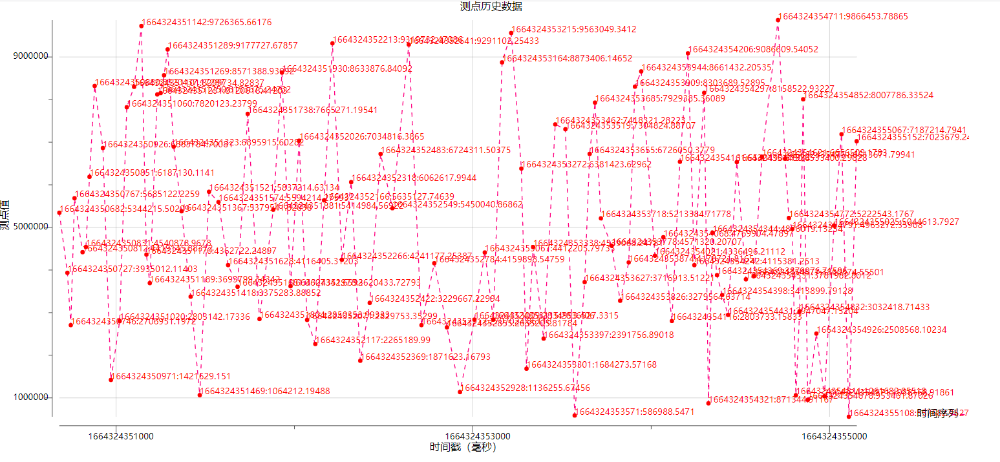
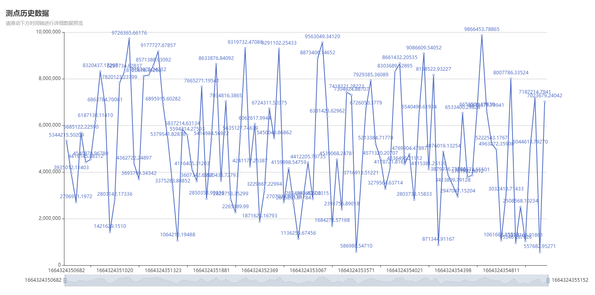

## 可视化数据查询展示

<b style="color:red">物联网数据库存储引擎自带！！！无需额外安装插件，即查即渲染，直接可视化</b>

### SVG展示

- > 支持`svg`图表展示，浏览器直接可以访问

  ```shell
  GET     /v1/draw/svg?w={h}&h={h}&sql={sql}
  
  POST    /v1/draw/svg
  Content-Type: application/json'
  {
  	"sql":"{sql}",
  	"w":{w},
  	"h":{h}
  }
  ```

- 参数说明：`*`标记参数为必填参数

  - `*sql`：查询时序数据`ASQL`引擎语句
  - `w`：页面渲染内容`width`，数字类型，单位`px`，默认值：1440
  - `h`：页面渲染内容`height`，数字类型，单位`px`，默认值：576

- 示例数据：

  ```shell
  curl --location --request GET 'http://127.0.0.1:8567/v1/draw/svg?w=1500&h=700&sql=select * from `t01.p01.a01.d01.p01` where id>1664267730968 ORDER BY ts desc LIMIT 100'
  ```

- 效果展示：

  

### Echarts展示

- > 支持`echarts`图表展示，浏览器直接可以访问

  ```shell
  GET     /v1/draw/echarts?w={h}&h={h}&sql={sql}
  
  POST    /v1/draw/echarts
  Content-Type: application/json'
  {
  	"sql":"{sql}",
  	"w":{w},
  	"h":{h}
  }
  ```
  
- 参数说明：`*`标记参数为必填参数

  - `*sql`：查询时序数据`ASQL`引擎语句
  - `w`：页面渲染内容`width`，数字类型，单位`px`，默认值：1440
  - `h`：页面渲染内容`height`，数字类型，单位`px`，默认值：576

- 示例数据：

  ```shell
  curl --location --request GET 'http://127.0.0.1:8567/v1/draw/echarts?w=1500&h=700&sql=select * from `t01.p01.a01.d01.p01` where id>1664267730968 ORDER BY ts desc LIMIT 100'
  ```

- 效果展示：

  