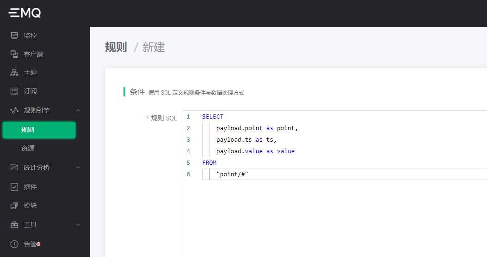
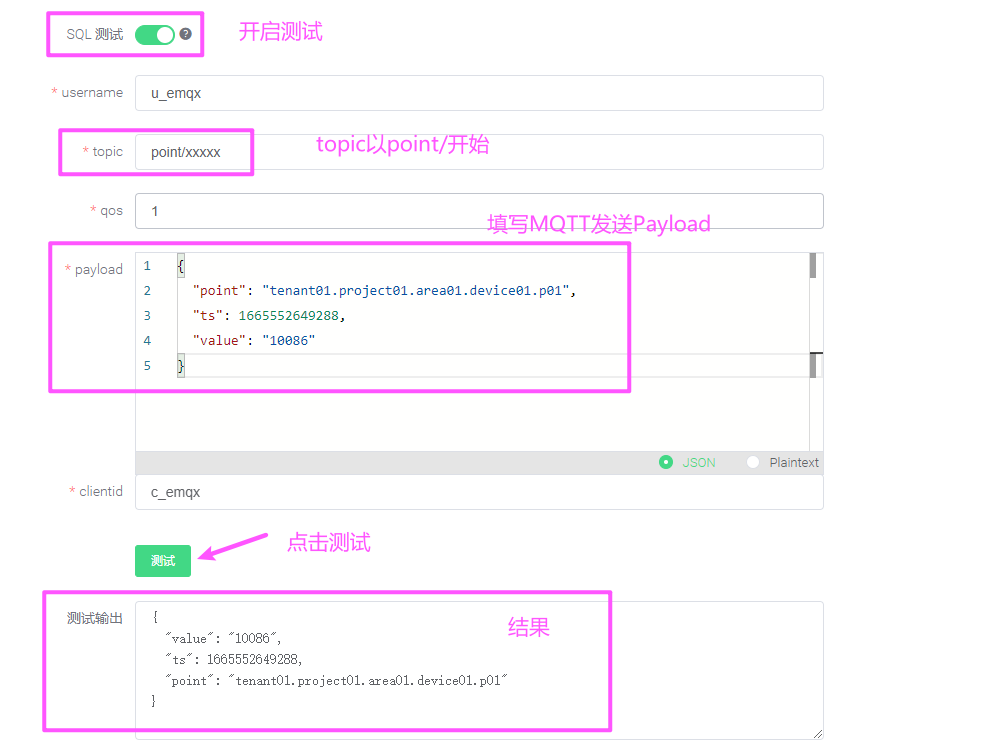
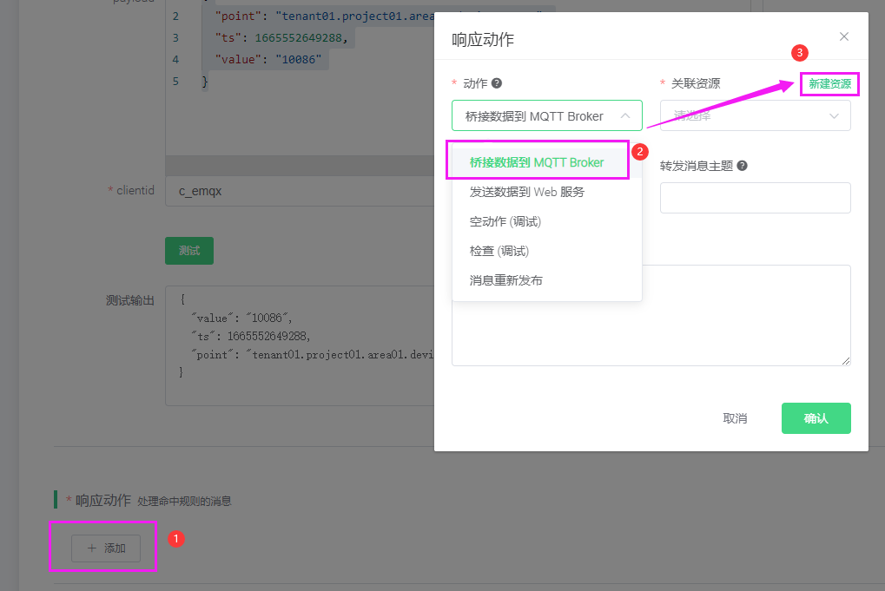
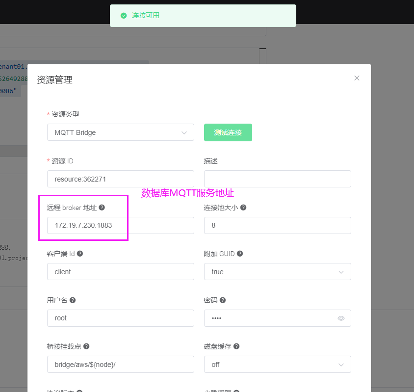
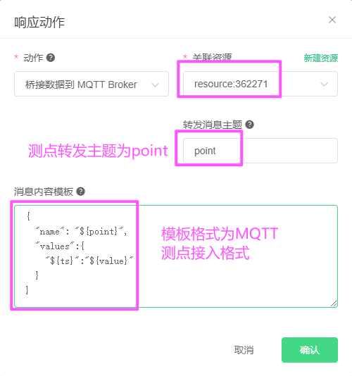
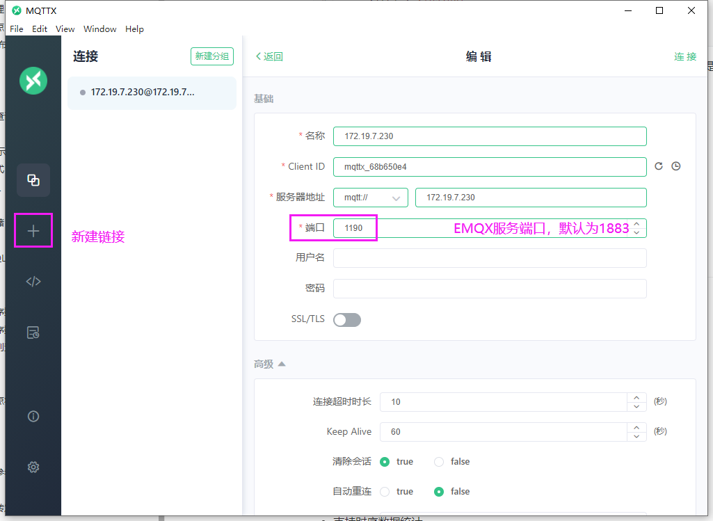
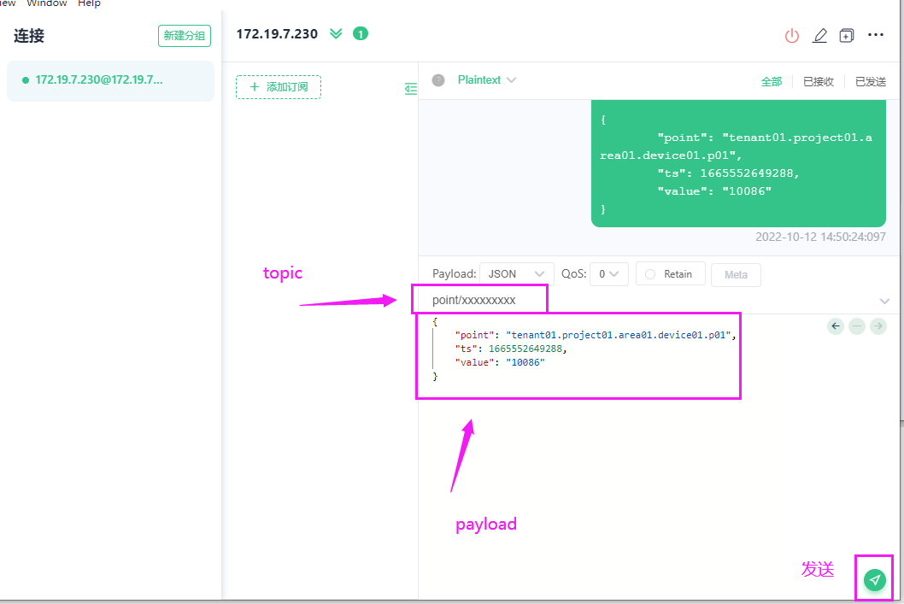
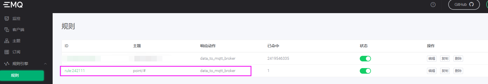

## EMQX集成

### <span id="point_broker">测点数据转发</span>

#### 配置规则

使用浏览器打开`EMQX`的 `Dashboard`，在规则引擎页面创建一条规则：



SQL 语句为：

```sql
SELECT
    payload.point as point,
    payload.ts as ts,
    payload.value as value
FROM
    "point/#"
```

测试数据有效性



Payload 语句为：

```json
{
	"point": "tenant01.project01.area01.device01.p01",
	"ts": 1665552649288,
	"value": "10086"
}
```

然后我们在页面的底部，给规则加一个「桥接数据到 MQTT Broker」动作：



这个动作需要关联一个资源，我们点击右上角的「新建资源」来创建一个`MQTT Bridge`资源：



远程 Broker 地址要填写 AIoTDB 的 MQTT 服务地址，即 "IP:1883"。客户端 Id、用户名、密码都填写 root，因为 root 是 AIoTDB 默认的用户名和密码。

其他选项保持默认值不变，点击「测试连接」按钮确保配置无误，然后再点击右下角的「新建」按钮创建资源。

现在返回到动作创建页面，关联资源的下拉框里自动填充了我们刚才创建的资源。

现在我们继续填写更多的动作参数：



AIoTDB 测点主题：`point`。

AIoTDB 要求消息内容是一个 JSON 格式，消息内容模板可以按照上图中样式填写。详情请参见[MQTT点存储](#mqtt_point)

```json
{
  "name": "${point}",
  "values":{
    "${ts}":"${value}"
  }
}
```

注意其中的 "${point}", "${ts}" 以及 "${value}" 都是从规则的 SQL 语句的输出中提取的变量，所以必须保证这些变量跟 SQL 语句的 SELECT 字句对应上。

现在可以点击「确认」保存动作配置


#### 使用 MQTT Client 发送消息

使用 MQTTX 客户端工具（https://mqttx.app），来发送一条消息给 `EMQX`：

MQTT 客户端的连接参数里面，我们注意端口号，使用`EMQX`服务的1883端口（端口可修改），其他的保持默认值不变。



模拟设备发送一条MQTT数据到`EMQX`代理服务

连接成功之后，我们发送 1 条主题为：`point/xxxxxxxx` 的消息，消息内容格式为：

```json
{
	"point": "tenant01.project01.area01.device01.p01",
	"ts": 1665552649288,
	"value": "10086"
}
```



然后回到 `EMQX Dashboard` 的规则引擎页面，观察规则的命中次数，确认规则被触发了 1 次：



最后我们查询`AIoTDB`数据，浏览器访问如下地址：

```shell
http://172.19.7.230:8567/v1/query?sql=select * from `tenant01.project01.area01.device01.p01`

{
	"code": 200,
	"msg": "操作成功",
	"data": [{
		"ts": 1665552649288,
		"value": "10086"
	}]
}
```


### 设备数据转发

参照[测点数据转发](#point_broker),消息内容模板可以请参见[MQTT设备存储](#mqtt_device)